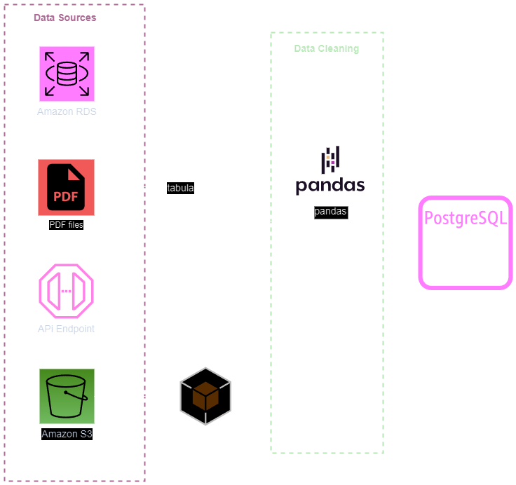
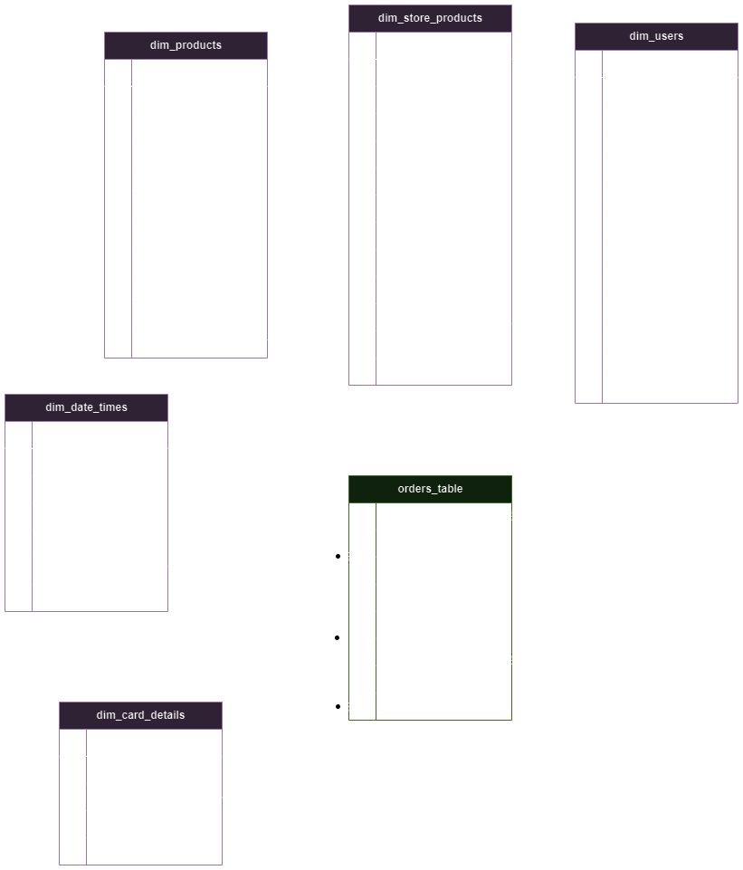

# Multinational Retail Data Centralisation 💼

# Table of contents

- [Multinational Retail Data Centralisation 💼](#multinational-retail-data-centralisation-)
- [Table of contents](#table-of-contents)
  - [Description](#description)
  - [Aim](#aim)
    - [Achievement Outcomes 📖](#achievement-outcomes-)
- [Installation and Usage Instructions ⚙](#installation-and-usage-instructions-)
  - [Dependencies](#dependencies)
  - [Installation Instructions](#installation-instructions)
  - [Demo](#demo)
    - [1. Database connection, data extraction and data cleaning](#1-database-connection-data-extraction-and-data-cleaning)
    - [2. Database schema development](#2-database-schema-development)
    - [3. Database querying](#3-database-querying)
    - [Result](#result)
- [File Structure 📂](#file-structure-)
- [License information 🗒](#license-information-)
- [Open source packages used in this project](#open-source-packages-used-in-this-project)
  - [Database connecting](#database-connecting)
  - [Data extracting/downloading](#data-extractingdownloading)
  - [Data cleaning](#data-cleaning)

## Description

This project is for collating retail sales data for a multinational company, where data is spread across multiple data sources to one centralised database. Facilitating accessibility and analysing for company team members to become more data-driven.



## Aim

Using [](https://www.python.org/) class methods are utilised for **connecting** to data sources, data **extraction** and **cleaning** downloaded data.

Cleaned data will be uploaded to a centralised [](https://www.postgresql.org) database. The star-based database schema developed manually, ensuring data columns are of the correct data type.

Querying the newly created centralised database to get up-to-date business metrics, using [](https://www.postgresql.org).

<details>
<summary><h3>Achievement Outcomes📖</h3></summary>

### Achievement Outcomes 📖

- Advanced object orientated programming in Python.
- Advanced development of Python class and methods.
- Creation and importing of python modules.
- Connecting to external databases - initiating connections, with database credentials accessed from hidden files.
- Querying and data retrieving methods from web APIs.
- Python method for data extraction from pdf files.
- Data base querying from AWS RDS database.
- Data downloading from AWS RDS and s3.
- Accessing data from multiple formats. E.g. *.json*, *.csv*, *.yaml* and, *.pdf* files.
- Data cleaning with pandas and numpy.
- Connecting and uploading to locally hosted PostgreSQL database.
- Developing star-based scheme for PostgreSQL database.
- Querying centralised database with PostgreSQL.
- Utilising CTEs in PostgreSQL queries.
- Advanced project documentation and versioning with Github.
- Applying Conda environments for project, and exportation to facilitate project collaboration.

</details>

# Installation and Usage Instructions ⚙

## Dependencies

Requires PostgreSQL with pgAdmin4

Requires Python3

Requires following packages:

      pandas
      tabula
      requests
      boto3
      yaml
      sqlalchemy
      pandas as pd
      numpy as np
      re

Installed by running:

`pip install <package_name>`

Alternatively, use [amy\_mrdc\_env.yaml](amy_mrdc_env.yaml) to import project conda environment, by running:

`conda create -f amy_mrdc_env.yaml -n <env_name>`

## Installation Instructions

1. `git clone https://github.com/amysw13/multinational-retail-data-centralisation.git`
2. `cd multinational-retail-data-centralisation`
3. Configure PostgreSQL centralised database and credentials to connect with AWS RDS, API and PostgreSQL
4. `python Classes/main.py` or `python3 Classes/main.py` to extract, clean and upload data to centralised database

---

## Demo


### 1. Database connection, data extraction and data cleaning

**Import class modules:**

```py
import Classes.database_utils as db_utils
import Classes.data_extraction as data_ext
import Classes.data_cleaning as data_clean
```

**Create instances of each class:**

```py
connector = db_utils.DatabaseConnector()
extractor = data_ext.DataExtractor()
cleaning = data_clean.DataCleaning()
```

Connecting to AWS RDS database:

*See [credentials\_template.yaml](Credentials/credentials_template.yaml) for an example to create own credentials file.*

```py
# Reading in AWS RDS database credentials from .yaml file.
creds = connector.read_db_creds()

# Create engine and connecting to AWS RDS database.
engine = connector.init_db_engine()

# Printing list of available tables names in AWS RDS database
db_list = connector.list_db_tables()

```

Data extraction/downloading:

```py
# Download data from 'legacy_users' table, using the AWS RDS specified connection engine.
rds_df = extractor.read_rds_table('legacy_users', engine)
```

Data Cleaning:

```py
# Data specific cleaning methods
clean_rds_df = cleaning.clean_user_data(rds_df)
```

Uploading dataframe to centralised database:

```py
# Cleaned df object uploaded to centralised database, table named as 'dim_users'.
connector.upload_to_db(clean_rds_df, 'dim_users')
```

---


### 2. Database schema development

Centralised database star-based schema development [database\_schema.ipynb](database_schema.ipynb)



### 3. Database querying
Applied PostgreSQL database querying [querying\_database.ipynb](querying_database.ipynb)

Example:

```sql
SELECT country_code,
    COUNT(country_code) AS total_no_stores
FROM
    dim_store_details
WHERE
    store_type != 'Web Portal'
GROUP BY
    country_code
ORDER BY
    total_no_stores DESC;

```

### Result

|country_code  |total_no_stores
|:------------:|:--------------:
|GB            |265
|DE            |141
|US            |34

# File Structure 📂

- 📂 __Classes__
  - 📄 [\_\_init\_\_.py](Classes/__init__.py)
  - 📄 [data\_cleaning.py](Classes/data_cleaning.py)
  - 📄 [data\_extraction.py](Classes/data_extraction.py)
  - 📄 [database\_utils.py](Classes/database_utils.py)
  - 📄 [main.py](Classes/main.py)
- 📂 __Credentials__
  - 📄 [credentials\_template.yaml](Credentials/credentials_template.yaml)
- 📂 __Data__
  - 📄 [date\_details.json](Data/date_details.json)
  - 📄 [products.csv](Data/products.csv)
- 📄 [LICENSE](LICENSE)
- 📄 [README.md](README.md)
- 📄 [amy\_mrdc\_env.yaml](amy_mrdc_env.yaml)
- 📄 [database\_schema.ipynb](database_schema.ipynb)
- 📄 [querying\_database.ipynb](querying_database.ipynb)
- 📄 [testing\_script.ipynb](testing_script.ipynb)

# License information 🗒

[MIT](LICENSE)

# Open source packages used in this project


## Database connecting


## Data extracting/downloading


## Data cleaning


